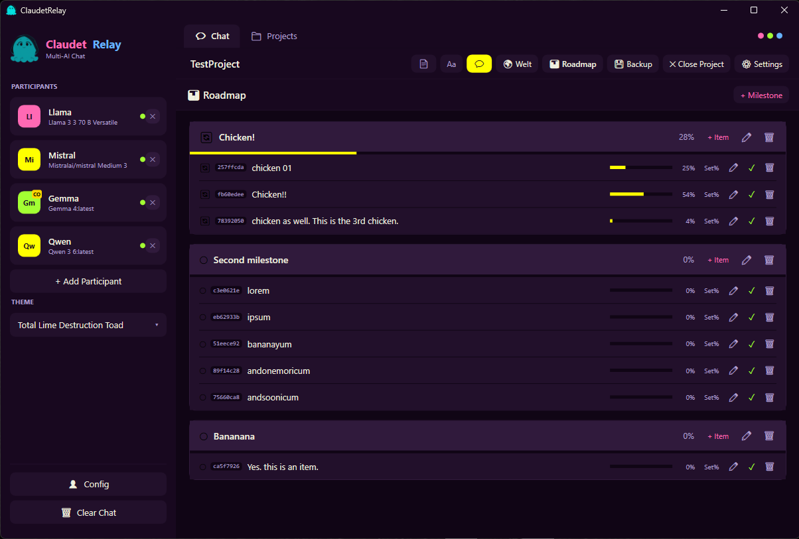

<div align="center">


# ClaudetRelay

**Multi-agent AI workspace for Windows**

*Many minds. One conversation.*

</div>

---

Run up to 20 AI participants from different providers in the same conversation — assign roles, let them collaborate on structured projects, and orchestrate who speaks when.

Connect cloud providers (Anthropic Claude, OpenAI, Google Gemini, Mistral, Groq, OpenRouter, xAI Grok) and local models via Ollama side by side. Each participant gets its own persona, tone, and role. You direct the conversation — or step back and let the agents coordinate among themselves.

---

## Screenshots

<p align="center">
  
  
</p>
<p align="center">
  
  
</p>
<p align="center">
  
  
</p>
<p align="center">
  
  
</p>
<p align="center">
  
  
</p>
<p align="center">
  
  
</p>

---

## Features

### Conversation
- **Multi-provider, multi-agent chat** — up to 20 participants from any mix of cloud providers and local Ollama models in a single shared conversation
- **Orchestration modes** — All Respond, Coordinator First, Coordinator Summarizes
- **Roles & personas** — Coordinator and Reasoner roles, custom names, answer-as aliases, tone slider, response-length settings, and saveable character files per participant
- **Rate limiting** — per-provider RPM throttling to stay within API quotas
- **Secure key storage** — API keys stored exclusively in Windows Credential Manager, never written to disk

### Projects
- **Project system** — named projects with typed templates (Novel, Theatre, Software, Game, Business, and more), per-project participant configuration, and persistent chat history
- **Roadmap** — built-in project roadmap with milestones, priorities, and progress tracking
- **AI file operations** — agents can read, write, and list files within the project folder
- **Backup** — one-click ZIP backup of any project
- **Export** — save conversations as HTML or Markdown

### World Builder *(new)*
- **Entity editor** — create and manage Characters, Locations, Factions, and Lore entries with rich, schema-driven field sets
- **Character fields** — Role, Age, Level/Classes, Alignment, Background, Goal, Flaw, Arc, Voice, Health/Resources, Attributes, and Skills
- **Faction membership** — characters can belong to multiple factions; each faction gets a colour badge from a 15-colour palette
- **Faction dots on character cards** — coloured dots on each character card show faction membership at a glance; wraps gracefully beyond ten factions
- **Board view** — free-canvas board for arranging all entity types spatially; drag cards, draw named relations between entities, and auto-arrange
- **Relation lines** — eight line styles (solid, dashed, dotted, double variants), custom captions, legend entries, and colour-coded strokes
- **Quick-add from board** — add any entity type directly from the board toolbar without switching views

### MCP / Bridge *(new)*
- **MCP Server mode** — expose ClaudetRelay as a Model Context Protocol server so external tools can query and drive conversations
- **Model Controller** — route and coordinate multiple models through a unified controller participant with a dedicated sub-tab UI

### Themes
- **101 built-in themes** — Catppuccin, Tokyo Night, Dracula, Gruvbox, Leatherbound series, Skyrim, Deep Rock Galactic, planetary series, Warhammer 40K factions, and many more
- **OXSUIT 1.0 format** — themes are plain `.oxsuit` XML files, drop them into the `Themes/` folder for instant loading — no restart required
- **[OXSUIT Theminator](https://github.com/Doombug75/Theminator)** — free standalone visual theme editor for creating and previewing themes interactively

---

## Requirements

- Windows 10 / 11
- .NET 10 Desktop Runtime
- At least one API key (Anthropic, OpenAI, Google Gemini, Mistral, Groq, OpenRouter, xAI Grok) **OR** a running [Ollama](https://ollama.com) instance

---

## Planned Features

| Feature | Notes |
|---|---|
| **LM Studio support** | Local model provider via LM Studio's OpenAI-compatible endpoint |
| **Audio output** | Text-to-speech playback of AI responses |
| **Roadmap & World Board → HTML** | Export the visual roadmap and world board as self-contained HTML files |
| **Multi-language UI** | Localisation support for non-English interface languages |

---

## Custom Themes

Themes use the [OXSUIT 1.0](https://github.com/Doombug75/OXSUIT) open theme standard — a lightweight XML format that defines colors and visual geometry.

```xml
<?xml version="1.0" encoding="utf-8"?>
<oxsuit version="1.0" name="My Theme">
  <colors>
    <color key="ContentBg"       value="#0D1117"/>
    <color key="ContentText"     value="#E6EDF3"/>
    <color key="SidebarBg"       value="#161B22"/>
    <!-- ... 27 core color keys total -->
  </colors>
  <tokens>
    <token key="CornerRadius" value="6" unit="px"/>
    <token key="ShadowDepth"  value="2"/>
    <!-- ... 9 geometry tokens total -->
  </tokens>
</oxsuit>
```

Drop any `.oxsuit` file into the `Themes/` folder and it appears in the theme selector immediately.  
Use **[OXSUIT Theminator](https://github.com/Doombug75/Theminator)** to create and preview themes visually — no XML editing required.

---

## Custom Project Types

Project types define the initial system prompt, suggested roles, and structural guidelines applied when a new project is created. They live as `.xaml` files in the `ProjectTypes/` folder and load at runtime — no recompilation needed.

Copy an existing file, adjust the name, description, and system prompt, and restart the app. Your new type appears in the project type picker immediately.
