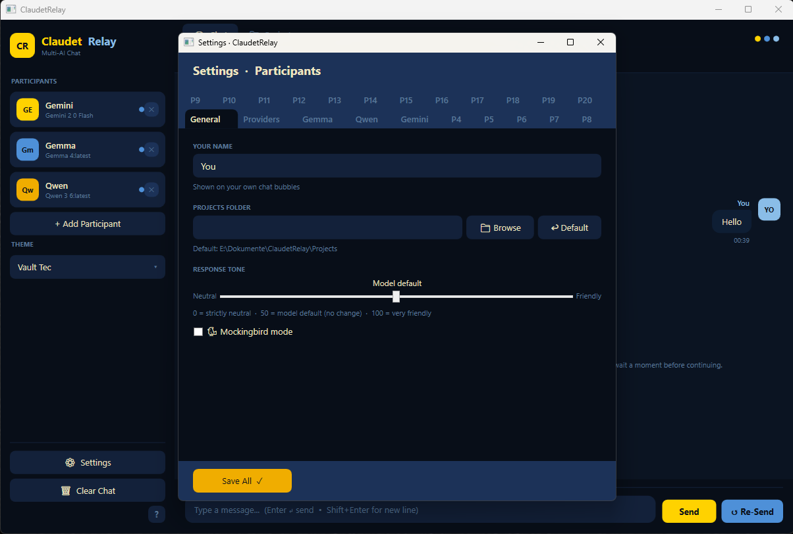
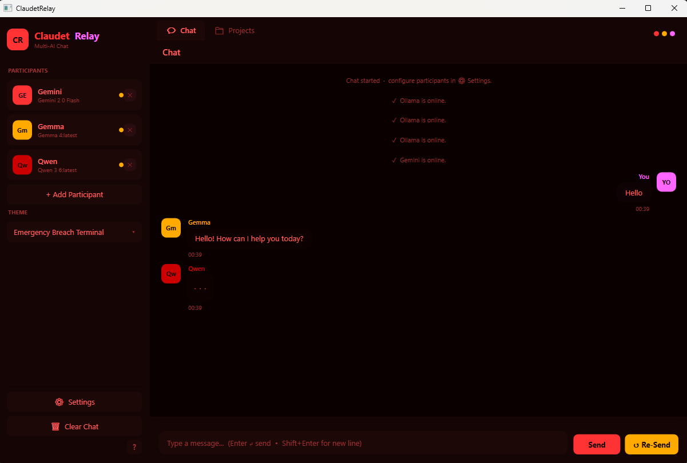
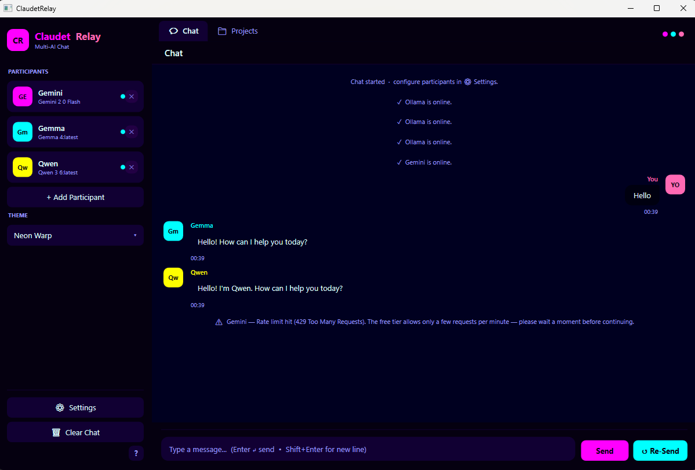

# ClaudetRelay

A **multi-agent AI workspace** for Windows — run up to 20 AI participants from different providers in the same conversation, assign them roles, let them collaborate on structured projects, and orchestrate who speaks when.

Connect cloud providers (Anthropic Claude, OpenAI, Google Gemini, Mistral, Groq, OpenRouter, xAI Grok) and local models via Ollama side by side. Each participant gets its own persona, tone, and role. You direct the conversation — or step back and let the agents coordinate among themselves.

---
## Screenshots

## Features

- **Multi-provider, multi-agent chat** — up to 20 participants from any mix of cloud providers and local Ollama models in a single shared conversation
- **Orchestration modes** — All Respond, Coordinator First, Coordinator Summarizes
- **Roles & personas** — Coordinator and Reasoner roles, custom names, answer-as aliases, tone slider, response-length settings, and saveable character files per participant
- **Project system** — named projects with typed templates (Novel, Theatre, Software, Game, Business, and more), per-project participant configuration, and persistent chat history
- **Roadmap** — built-in project roadmap with items, priorities, and progress tracking
- **AI file operations** — agents can read, write, and list files within the project folder
- **Export** — save conversations as HTML or Markdown via right-click
- **Rate limiting** — per-provider RPM throttling to stay within API quotas
- **Secure key storage** — API keys stored exclusively in Windows Credential Manager, never written to disk
- **Themes** — 60+ themes including Catppuccin, Tokyo Night, Dracula, Gruvbox, and many custom designs

---

## Requirements

- Windows 10 / 11
- .NET 10 Desktop Runtime
- At least one API key (Anthropic, OpenAI, Google Gemini, Mistral, Groq, OpenRouter, xAI Grok) **OR** a running [Ollama](https://ollama.com) instance

---

## Known Bugs

| # | Description |
|---|-------------|
| 1 | **Reasoner role not respected in Coordinator-First mode** — Participants marked as Reasoners still respond to every user message instead of only responding when the Coordinator explicitly delegates a task to them by name. Architectural fixes have been partially applied (history filtering, coordinator system-prompt constraints) but the behaviour is not yet fully reliable. |

---

## Planned for Next Release

- **Fix Reasoner orchestration** — Reasoners must be fully silent until the Coordinator tags them. Requires a reliable end-to-end solution: the user message must never reach a Reasoner's context, and the delegation detection / call chain must be validated across all provider paths (Ollama + Cloud AI).
