<div align="center">


# ClaudetRelay

**Multi-agent AI workspace for creative projects on Windows**

*Brainstorm. Build. Organise. Create.*

</div>

---

ClaudetRelay is a **creative project workspace** powered by a team of AI participants.
Whether you are writing a novel, designing an RPG campaign, building a game, or mapping out a software project — you direct a group of AI agents who brainstorm, plan, research, and generate documents alongside you.

Unlike a simple chatbot, ClaudetRelay organises your work into **structured projects** with their own file systems, roadmaps, world-builder databases, and agent rosters. Everything the AI produces is saved as real, plain files you can open, edit, and diff in any tool — no locked-in database, no hidden state.

---

### What can you do with it?

| Use case | How ClaudetRelay helps |
|---|---|
| **RPG world building** | Build a campaign setting with Characters, Locations, Factions, and Lore. Visualise relationships on a free-canvas board. Let AI agents invent NPCs, histories, and plot hooks on demand. |
| **Fiction & story writing** | Assign one agent as your plot architect, another as a character voice, a third as continuity checker. Run them in parallel and compare their takes. |
| **Game design** | Use the roadmap to track milestones, let AI agents produce design docs, dialogue trees, and balance spreadsheets — all saved as real files in your project folder. |
| **Software planning** | Break a codebase into tasks on the roadmap, have agents draft specs, architecture diagrams, and READMEs, output them as PDF or Word docs. |
| **Brainstorming & research** | Throw a question to six models at once and compare answers side by side. Use a Coordinator agent to synthesise the best ideas from the group. |

Supports many API- and local Server (Ollama, vLLM) based Providers. You can connect them all. 
Projects and world builder also work without using AI models, if necessary.

---

### Boards on boards — the World Builder

The heart of ClaudetRelay for creative projects is the **World Builder** — a spatial canvas where you place entity cards (Characters, Locations, Factions, Lore items) and draw named relation lines between them.

Each entity has a rich set of fields (role, alignment, backstory, arc, resources, skills, portrait…). Cards can carry **nested boards** — so a Faction card can open its own internal board listing its members and their relationships. You build as deep as your world needs.

AI agents can read the world state, suggest new entities, and write directly into the project's entity files. They see the same structured data you see.

Left-drag cards to move them, left-drag empty space for rubber-band multi-select, right-drag to pan. Full board controls are documented in the in-app Claudette Help (the 🐙 button).

---

### Behaviour controls — directed or autonomous

A layered set of controls lets you tune how the AI team behaves:

| Setting | Scope | What it does |
|---|---|---|
| **Tone** | Global | Formal ↔ casual, or a fixed personality mode (Mockingbird / Buccaneer) |
| **Chattiness** | Per chat / per project | How eagerly participants join without being prompted |
| **Autonomy** | Per project | How independently agents act when left to run |
| **Response length** | Global + per participant in project | Concise ↔ exhaustive |
| **Role** | Per participant | Coordinator (summarises, delegates) or Reasoner (executes, creates) |
| **Role instructions** | Per participant in project | Free-text instructions that override or extend the default behaviour for that agent in this project |

Point them at pure creative output and step back — or keep tight control and use them as smart research assistants. The same app supports both styles.

---

### Transparent file output

Every file the AI produces lands in your project's folder as a real file:

```
MyProject/
  INPUT/          ← files you give the agents to read
  OUTPUT/         ← files agents generate
  PROJECTPLAN/    ← roadmap, design docs, notes
  AI-Characters/  ← per-project agent persona files
```

Agents can **read** `.txt`, `.md`, `.pdf`, `.docx`, `.xlsx`, `.pptx`, `.odt`, `.ods`, `.odp` from INPUT and **write** formatted output to OUTPUT:

| Output tag | Format |
|---|---|
| `<output file="notes.md">` | Plain Markdown |
| `<outputpdf file="report.pdf">` | PDF (A4, styled headings, tables, code blocks) |
| `<outputoffice file="report.docx">` | Word document |
| `<outputoffice file="report.odt">` | LibreOffice Writer |
| `<outputoffice file="data.xlsx">` | Excel (each Markdown table → its own sheet) |
| `<outputoffice file="data.ods">` | LibreOffice Calc |

No conversion tools, no LibreOffice install, no Adobe — everything is generated natively from Markdown.

---

### Connect any AI provider

| Cloud | Local |
|---|---|
| Anthropic Claude | Ollama (any model) |
| Ollama ☁ (cloud-hosted) | LM Studio |
| OpenAI GPT | vLLM |
| Google Gemini | |
| Mistral | |
| Groq | |
| OpenRouter | |
| xAI Grok | |
| DeepSeek | |
| Fireworks AI | |
| Perplexity AI | |
| Together AI | |
| Nvidia NIM | |
| Cerebras | |
| DeepInfra | |

Mix cloud and local agents in the same project. Run a fast local model for first drafts and a large cloud model for final polish. API keys are stored exclusively in Windows Credential Manager — never written to disk.

---

## Screenshots

<p align="center">
  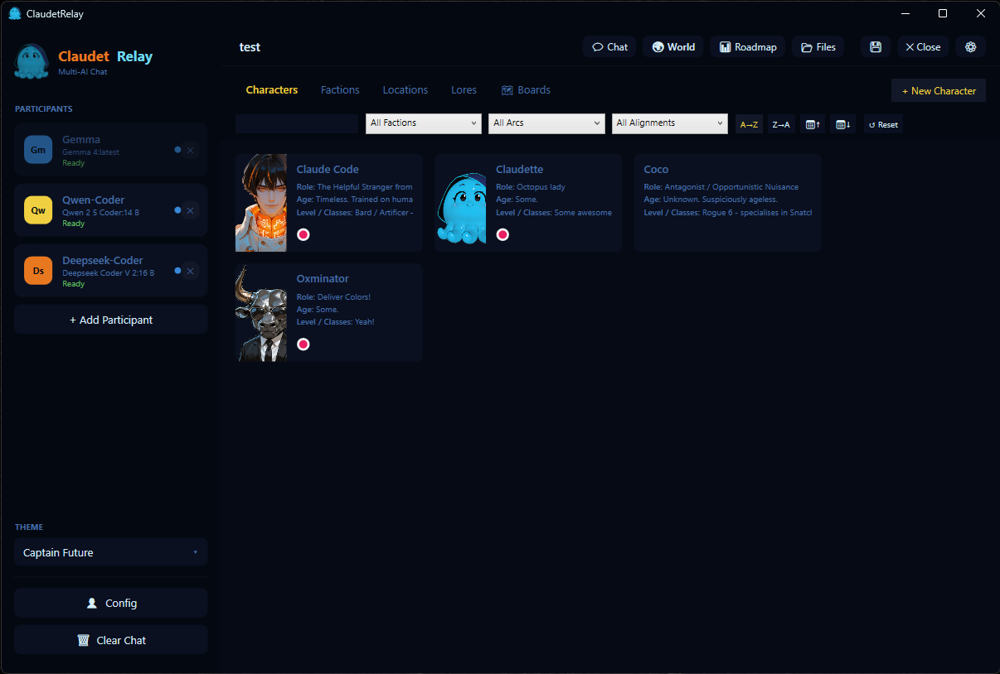
  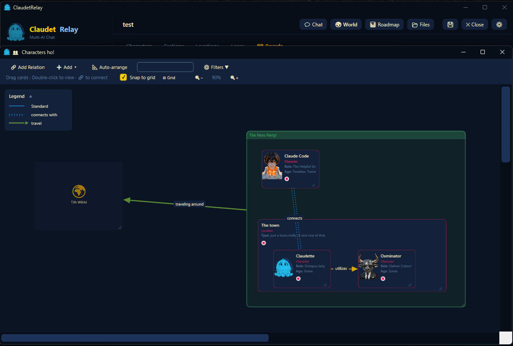
</p>
<p align="center">
  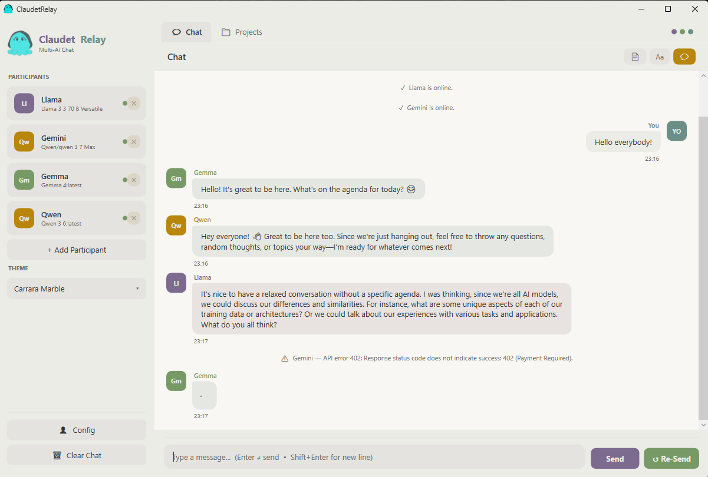
  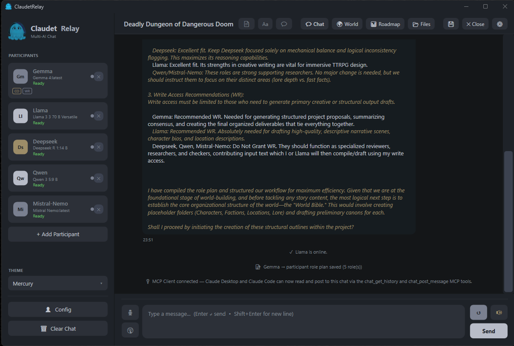
</p>
<p align="center">
  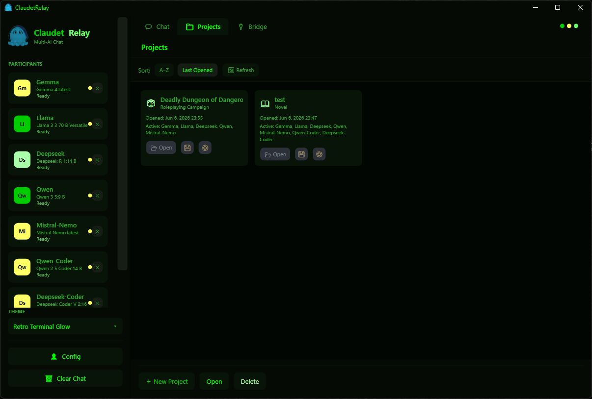
  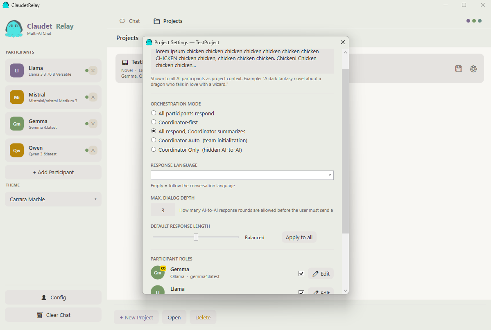
</p>
<p align="center">
  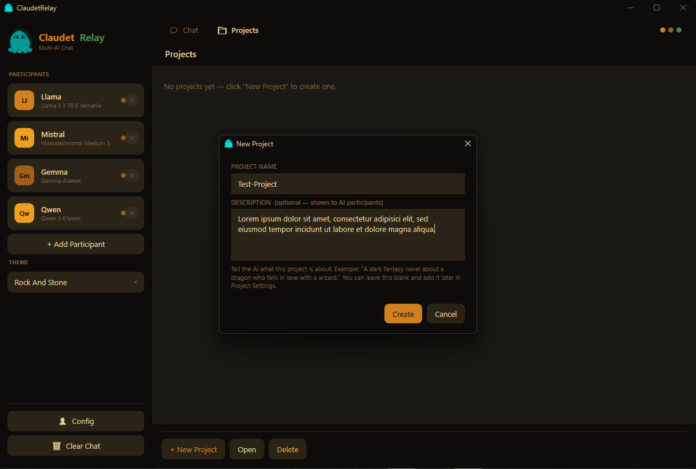
  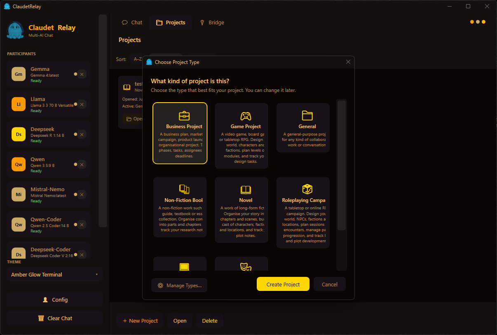
</p>
<p align="center">
  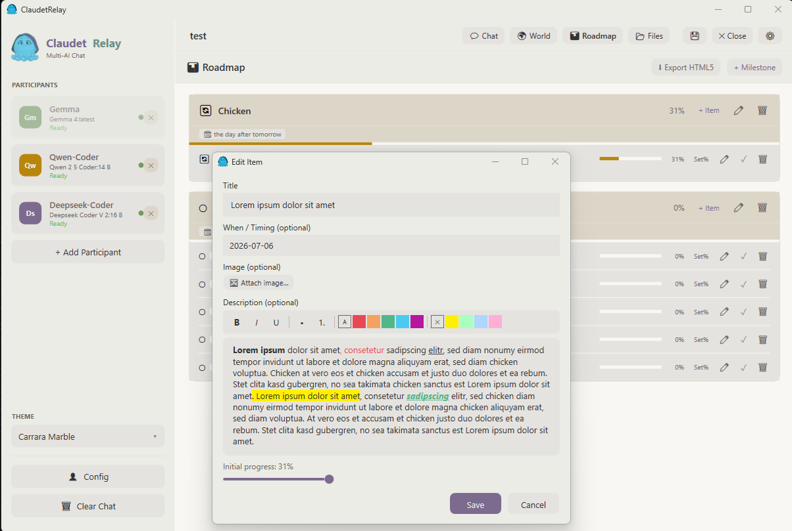
  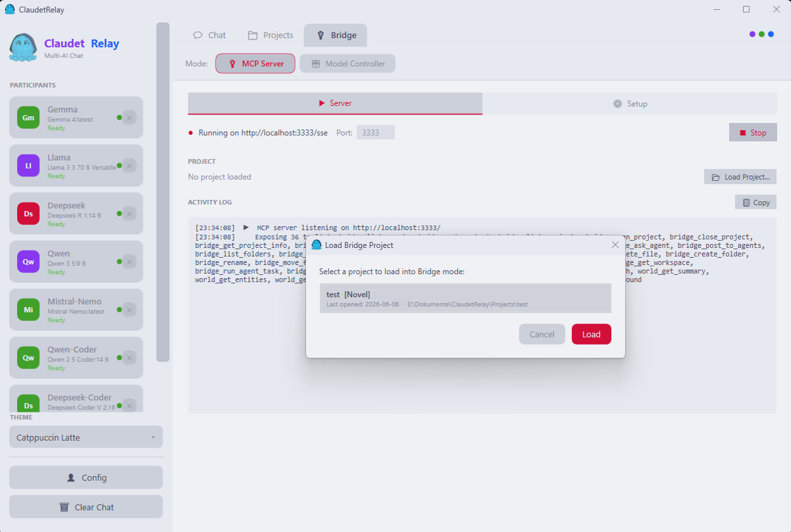
</p>
<p align="center">
  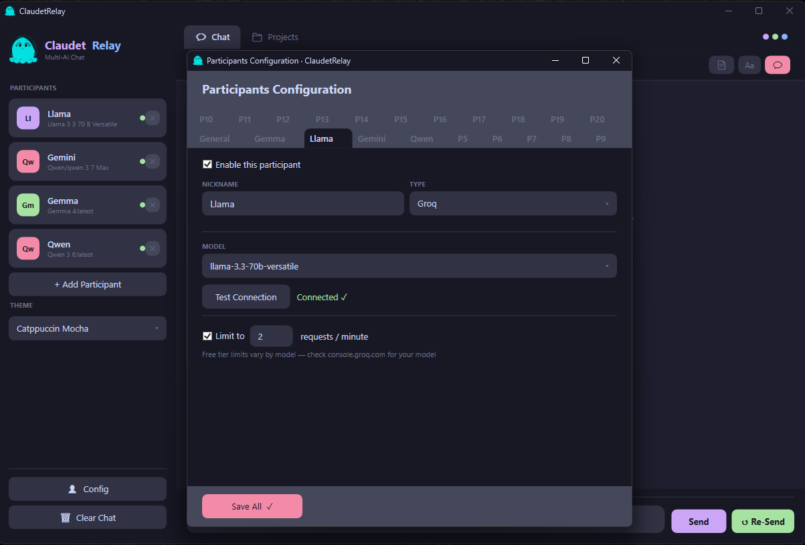
  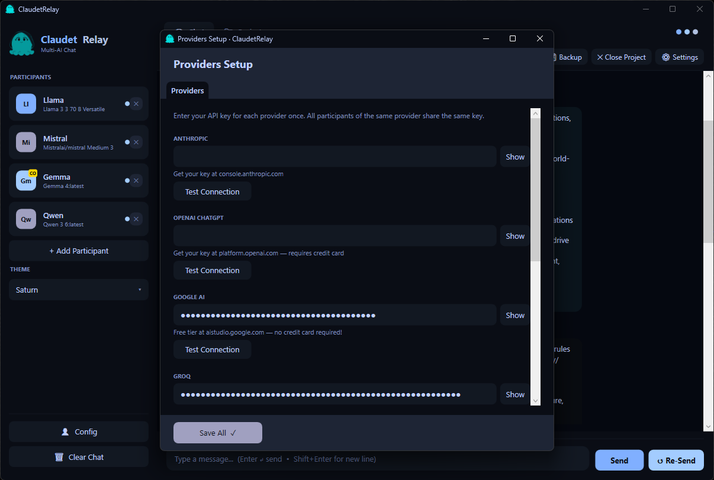
</p>
<p align="center">
  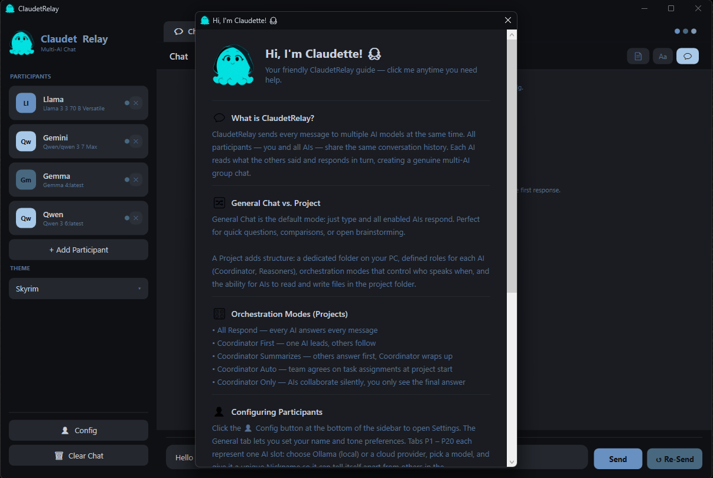
  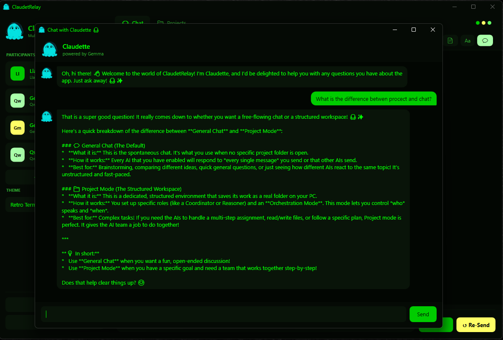
</p>

---

## Full Feature List

### Conversation
- **Multi-provider, multi-agent chat** — any number of participants from any mix of cloud providers and local models in a single shared conversation; each participant gets its own card in the UI
- **Orchestration modes** — All Respond, Coordinator First, Coordinator Summarizes, Coordinator Only
- **Roles & personas** — Coordinator, Reasoner, Critic, Planner, Researcher roles; custom names, answer-as aliases, and saveable character files per participant
- **Tone** — global formal ↔ casual slider; or lock to Mockingbird (warm/dramatic) or Buccaneer (pirate) personality mode
- **Chattiness** — per-chat and per-project slider controlling how eagerly participants join without being prompted
- **Response length** — global default; can be overridden per participant inside a project
- **AI-to-AI dialogue** — enable multi-round dialogue so participants can read and reply to each other before the next user message; configurable turn limit
- **Whispering** — send a message to a single participant without others seeing it
- **Grounded responses** — system prompt injection discourages models from impersonating real people or inventing personal traits unless a role instruction explicitly allows it *(effectiveness varies by model)*
- **Rate limiting** — per-provider RPM throttling to stay within API quotas
- **Secure key storage** — API keys stored exclusively in Windows Credential Manager, never written to disk
- **Voice output** — text-to-speech playback of AI responses using Windows TTS, offline neural voices (Sherpa-onnx / Whisper), or VOICEVOX; per-participant voice assignment
- **Voice input** — push-to-talk and voice-activation dictation using a locally-running offline speech recogniser; no cloud required

### Projects
- **Project system** — named projects with typed templates (Novel, Theatre, Software, Game, Business, Roleplaying Campaign, and more), per-project participant configuration, and persistent chat history
- **Per-project autonomy** — slider that controls how independently agents operate when you step back; each project can have its own setting
- **Per-participant role instructions** — free-text instructions per agent inside a project, letting you specialise behaviour beyond the global persona
- **Roadmap** — built-in project roadmap with milestones, items, per-item progress tracking, rich text descriptions, attached images, and timing notes; export as standalone HTML5
- **File browser** — collapsible folder sections with search filter; browse INPUT, OUTPUT, PROJECTPLAN folders inside the app
- **File checkout** — read-only and read-write file locking so multiple agents can research in parallel without overwriting each other; smart idle-timeout reminder system
- **AI file reading** — agents can read `.txt`, `.md`, `.rst`, `.html`, `.csv`, `.pdf`, `.docx`, `.xlsx`, `.pptx`, `.odt`, `.ods`, `.odp` directly from INPUT
- **AI file writing** — agents can write Markdown, PDF, Word, LibreOffice Writer, Excel, and LibreOffice Calc files to OUTPUT with a single tag
- **Backup** — one-click ZIP backup of any project
- **Export** — save conversations as HTML or Markdown

### World Builder
- **Entity editor** — create and manage Characters, Locations, Factions, and Lore entries with rich, schema-driven field sets
- **Character fields** — Role, Age, Level/Classes, Alignment, Background, Goal, Flaw, Arc, Voice, Health/Resources, Attributes, and Skills
- **Portrait support** — add portrait images to characters; duplicate-safe filename handling keeps the entity list clean
- **Faction membership** — characters can belong to multiple factions; each faction gets a colour badge from a 15-colour palette
- **Faction dots on character cards** — coloured dots on each character card show faction membership at a glance
- **Board view** — free-canvas board for arranging all entity types spatially; drag cards, rubber-band multi-select, right-drag to pan, draw named relations between entities, and auto-arrange
- **Nested boards** — boards can contain boards; build hierarchy as deep as your world requires
- **Relation lines & arrows** — eight line styles (solid, dashed, dotted, double variants), optional arrowheads, custom captions, legend entries, and colour-coded strokes; lines are segmentable so you can split and re-route them around cards
- **Quick-add from board** — add any entity type directly from the board toolbar without switching views

### MCP / Bridge
- **MCP Server mode** — expose ClaudetRelay as a Model Context Protocol server; connect Claude Desktop, Claude Code, or any MCP-compatible client
- **MCP chat participation** — external clients can read chat history and post messages as named participants via `chat_get_history`, `chat_post_message`, and `chat_wait_for_round` tools
- **Bridge agents** — register local Ollama models or cloud models as named Bridge agents; send tasks silently via `bridge_post_to_agents` without routing through the chat
- **Project agent roster** — save a Bridge agent roster per project; load it with one click when a project is open
- **Model Controller** — route and coordinate multiple local models through a cloud controller
- **Configurable tool access** — enable or disable individual MCP tools per mode from the Bridge settings window

### Themes & UI
- **101 built-in colour themes** — includes well-known community palettes (Catppuccin, Tokyo Night, Dracula, Gruvbox) and a large collection of original themes with colour palettes *inspired by the colours of* Skyrim, Deep Rock Galactic, Warhammer 40K factions, leatherbound books, the planets of our solar system, retro terminals, and more — purely colour work, no licensed artwork or UI assets
- **Light and dark themes** — full support for both; themes like Catppuccin Latte, Carrara Marble, and Arctic Aurora work in bright environments
- **OXSUIT 1.0 format** — themes are plain `.oxsuit` XML files; drop them into the `Themes/` folder for instant loading — no restart required
- **[OXSUIT Theminator](https://github.com/Doombug75/Theminator)** — free standalone visual theme editor for creating and previewing themes interactively
- **UI zoom** — global zoom level applied to all windows and dialogs
- **External language packs** — drop a `Languages/xx.json` file next to the exe to add or override any UI string; `en.json` and `de.json` example packs are included; missing keys fall back to English automatically

---

## Requirements

- Windows 10 / 11
- [.NET 10 Desktop Runtime](https://dotnet.microsoft.com/en-us/download/dotnet/10.0)

Everything else is optional — AI providers, local model servers, and API keys are only needed if you want AI participation. Projects, World Builder, Roadmap, and file output all work without any AI connected.

---


## Custom Themes

Themes use the [OXSUIT 1.0](https://github.com/Doombug75/OXSUIT) open theme standard — a lightweight XML format that defines colors and visual geometry.

```xml
<?xml version="1.0" encoding="utf-8"?>
<oxsuit version="1.0" name="My Theme">
  <colors>
    <color key="ContentBg"       value="#0D1117"/>
    <color key="ContentText"     value="#E6EDF3"/>
    <color key="SidebarBg"       value="#161B22"/>
    <!-- ... 27 core color keys total -->
  </colors>
  <tokens>
    <token key="CornerRadius" value="6" unit="px"/>
    <token key="ShadowDepth"  value="2"/>
    <!-- ... 9 geometry tokens total -->
  </tokens>
</oxsuit>
```

Drop any `.oxsuit` file into the `Themes/` folder and it appears in the theme selector immediately.  
Use **[OXSUIT Theminator](https://github.com/Doombug75/Theminator)** to create and preview themes visually — no XML editing required.

---

## Custom Language Packs

The UI ships with English and German built in. To add a new language (or override individual strings), drop a JSON file named after your locale into the `Languages/` folder next to `ClaudetRelay.exe`:

```
ClaudetRelay.exe
Languages/
  en.json   ← English example (all 782 keys)
  de.json   ← German example
  fr.json   ← your translation (partial packs are fine)
```

The file format is a flat JSON object — copy `en.json`, rename it, translate the values, and save. Missing keys fall back to English automatically, so you can ship a partial pack and fill in the rest over time.

Want to crowdsource translations? Run ClaudetRelay in Bridge mode, point a few AI agents at `en.json`, and have them translate it to French, Spanish, or Martian — the output drops straight into `Languages/`.

---

## Custom Project Types

Project types define the initial system prompt, suggested roles, and structural guidelines applied when a new project is created. They live as `.xaml` files in the `ProjectTypes/` folder and load at runtime — no recompilation needed.

Copy an existing file, adjust the name, description, and system prompt, and restart the app. Your new type appears in the project type picker immediately.


---

## Upcoming / Things at work

-**Text filters** - Right now, you can easily buzz out any local model with PDF bigger that a few pages or even a noisy markdown. Filtered file streams will improve that behaviour and should also help reduce context useage.

-**Memory improvements** - Right now, every bigger conversation between different models, some being very talkative (so you have to push that ruler down to "Brief" to Keep longer conversations working), goes into the context. Means you have to delete the conversation and Restart the app after a while. Gotta think About a few ways to store history locally and give the model a compacted Version back to Keep context at some Level.
